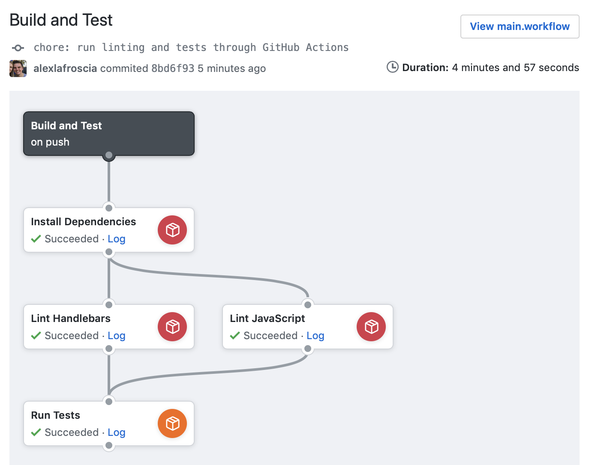

# actions-ember-testing

> GitHub Action for Ember Testing

This GitHub Action provides a Node 10 environment and Headless Chrome, so you can run your Ember tests in GitHub Actions.

A basic workflow looks something like this:



```hcl
workflow "Build and Test" {
  on = "push"
  resolves = [
    "Lint Handlebars",
    "Lint JavaScript",
    "Run Tests",
  ]
}

action "Install Dependencies" {
  uses = "nuxt/actions-yarn@node-10"
  args = "install"
}

action "Lint Handlebars" {
  uses = "nuxt/actions-yarn@node-10"
  needs = ["Install Dependencies"]
  args = "lint:hbs"
}

action "Lint JavaScript" {
  uses = "nuxt/actions-yarn@node-10"
  needs = ["Install Dependencies"]
  args = "lint:js"
}

action "Run Tests" {
  uses = "alexlafroscia/actions-ember-testing@master"
  needs = ["Lint Handlebars", "Lint JavaScript"]
  args = "test"
}
```

What this would do is:

1. Install your dependencies using `yarn`
2. Run linting in parallel
   1. Run `yarn lint:js`
   1. Run `yarn lint:hbs`
3. Run `ember test` if linting passed

Each step is only completed if the previous tasks succeed.

## Differences from Travis CI

Using GitHub Actions differs a bit from the experience of using Travis CI. Changes that you make to the environment are persisted between actions, which allows you to break up each part of your process into a separate step while building on top of the previous ones.

To recreate the workflow above in Travis CI, you'd need to use their Build Stage feature, which allows you to run multiple separate steps independently from one another. However, because each step is isolated, each of them would need to install their own dependencies rather than getting to share the same set. This allows GitHub Actions to run a lot faster than Travis CI; you only need to install your dependencies once.
